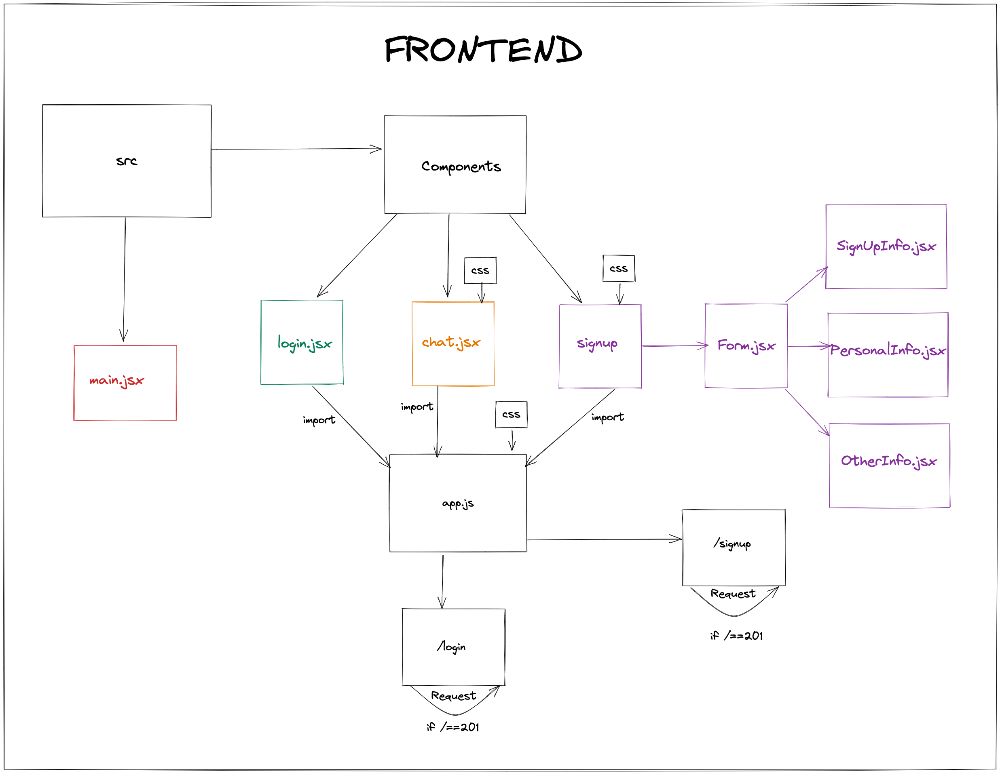

# friendzone

To find and start a conversation with friends. An interactive application that allows you to search and connect with new and existing friends.

## Tech stack

* Node (v18.12)
* NPM (8.19.2)
* Jest (v29.3.1) for unit testing on the backend.
* Cypress for end-to-end testing and component testing on the frontend.
* Tailwind CSS (v2.2.19) for styling.
* Mongoose to model objects in MongoDB.
* Handlebars for the home template.
* ESLint for linting.
* Nodemon (2.0.20) to reload the server automatically.
* vite (3.2.3)
* vitest (0.25.2)
  
## User Stories
```
As a friendzone user
So I can signup with ease 
I would like to login and logout. 
```

```
As a friendzone user
So that I can find friends.
I would like to message all my friends.
```

```
As a friendzone user
So that I can swipe through a list of possible new friends.
I would like to see a list of my friends.
```

```
As a friendzone user
So that I can find and connect with likeminded people.
I would like to find new friends with the same interests.
```

```
As a friendzone user
So that I can find and connect with existing friends and peers.
I would like to find existing friends.
```

```
As a friendzone user
So I can group friends together by groups - politics, sports etc
I would like to be matched with likeminded people based on hobbies and activities.

```

## Diagrams

### Backend Diagram


### Frontend Diagram


## How to run

Clone this repository:

```
git clone https://github.com/Dmum303/MERNsters-inc.git

```

Run the frontend:

```
cd frontend
npm install
npm run start
```

# Project setup

1. Fork this repository
2. Clone your fork to your local machine
3. Install Node.js dependencies for both frontend and backend (API)
   ```
   ; cd backend
   ; npm i
   ; cd ../frontend
   ; npm i
   ```

4. Install MongoDB
   ```
   brew tap mongodb/brew
   brew install mongodb-community@5.0
   ```
5. Start MongoDB
   ```
   brew services start mongodb-community@5.0
   ```

# Running the application

1. Start the server
   ```
   ; cd backend
   ; JWT_SECRET=SUPER_SECRET npm start
   ```
2. Start the front end

  In a new terminal session...
  ```
  ; cd frontend
  ; npm run start
  ```

You should now be able to open your browser and go to `http://localhost:3000/` which directs you to the hompeage, where you can sign-up or log in.

(Add heroku link here)

## Running mongoDB

```shell
   # Start the mongo terminal/REPL
   mongosh
```

## Mongosh commands

```shell
   # Show all databases
   show dbs

   # Switch to a database
   use <database name>

   # Show all collections in the current database
   show collections

   # Show all documents in a collection
   db.<collection name>.find()

   # Show all documents in a collection, formatted
   db.<collection name>.find().pretty()
```
### Testing


#### The Backend (API)

**Note the use of an environment variable for the JWT secret**

  Start the server in test mode (so that it connects to the test DB)

  ```
  ; cd api
  ; JWT_SECRET=SUPER_SECRET npm run start:test
  ```

  Then run the tests in a new terminal session

  ```
  ; cd api
  ; JWT_SECRET=SUPER_SECRET npm run test
  ```

  # The Mernsters team

This project was created by:

- [Arshad Siddiqui](https://github.com/Arshad-Siddiqui)
- [David Thomson](https://https://github.com/Dmum303)
- [Sarita Radia](https://github.com/saritahub)
- [Pauline Davis](https://github.com/paulinejdavis)
- [Tauqeer Shoaib](https://github.com/tauqeer92)
- [Blake O'Donnell](https://github.com/blakerodonnell)